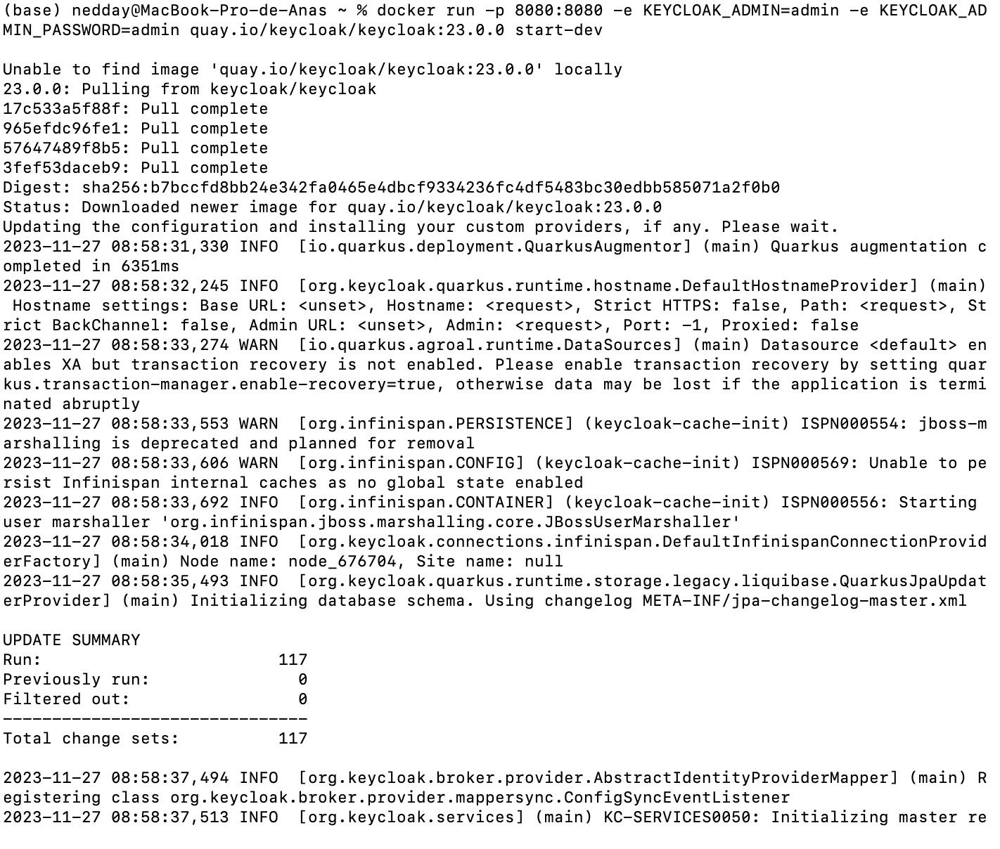
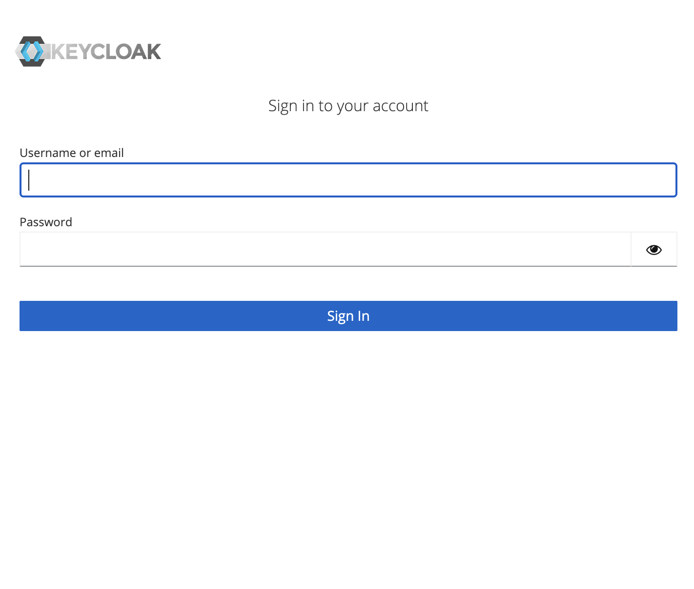
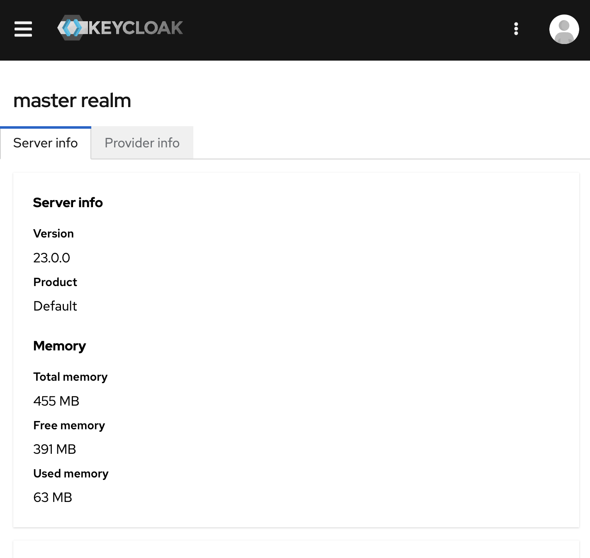
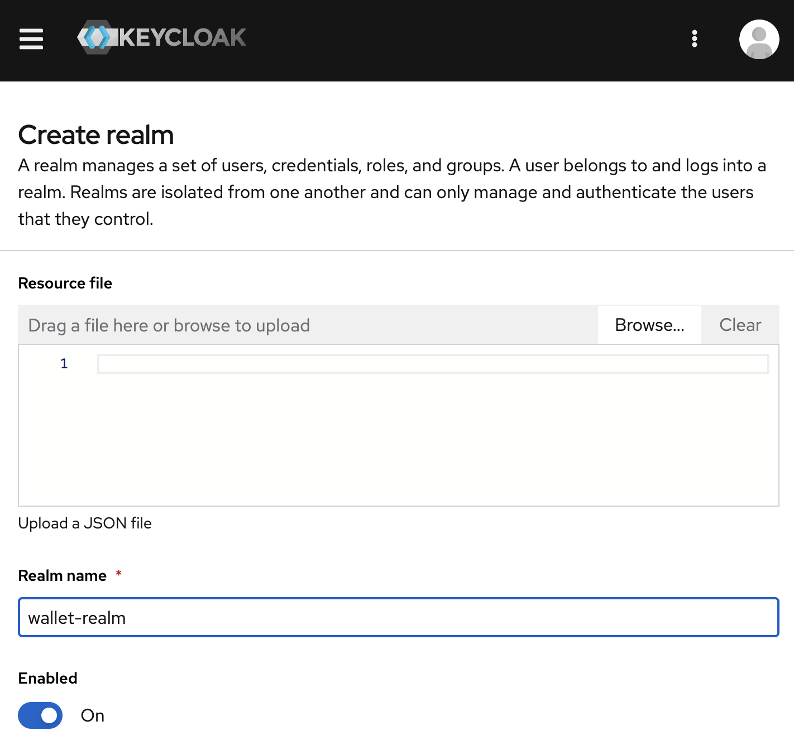
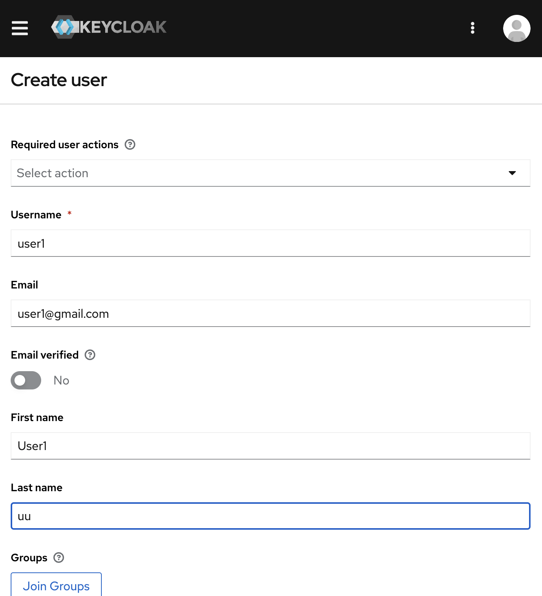
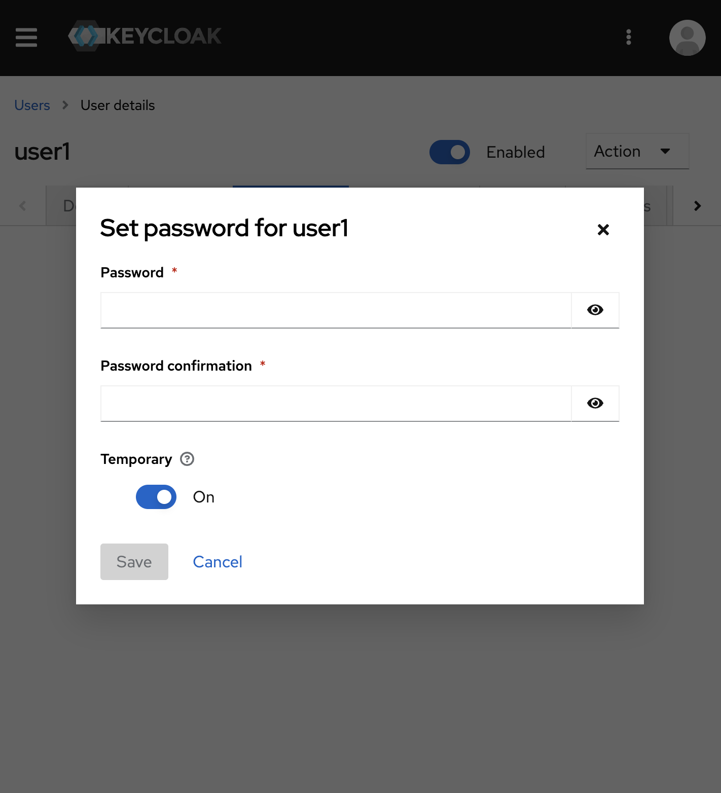
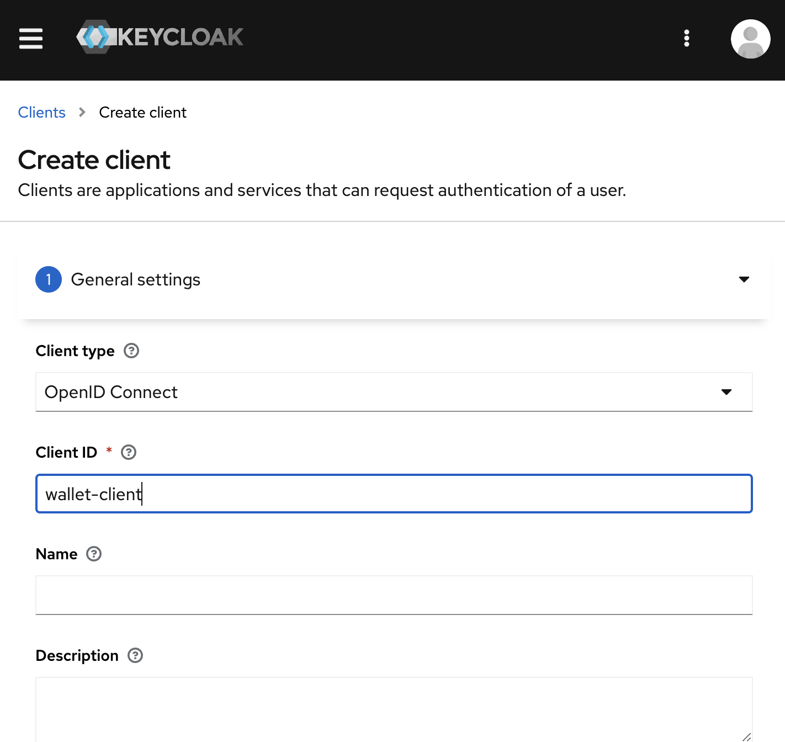
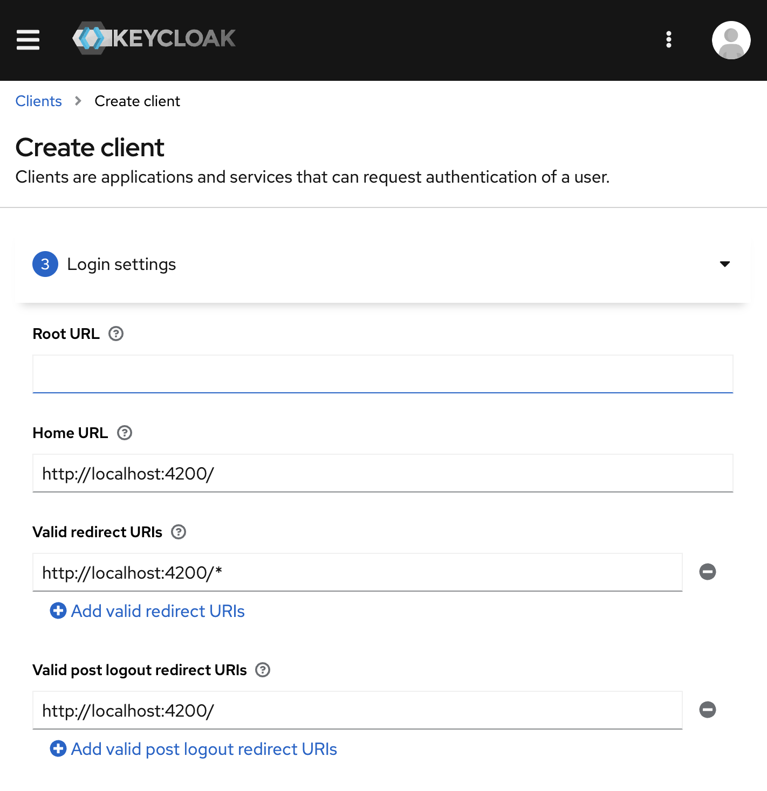

# Security-of-Distributed-System-Using-Keycloack : 
---
#### Downloading Keycloack Image : 
from https://www.keycloak.org/getting-started/getting-started-docker
#### Docker Image : 
##### Start Keycloak
From a terminal, enter the following command to start Keycloak:
```sh
$ docker run -p 8080:8080 -e KEYCLOAK_ADMIN=admin -e KEYCLOAK_ADMIN_PASSWORD=admin quay.io/keycloak/keycloak:23.0.0 start-dev
```


This command starts Keycloak exposed on the local port 8080 and creates an initial admin user with the username admin and password admin.

---
##### Log in to the Admin Console:

1-Go to the Keycloak Admin Console on localhost:8080

2-Log in with the username and password you created earlier.



---
##### Create a realm :
A realm in Keycloak is equivalent to a tenant. Each realm allows an administrator to create isolated groups of applications and users. Initially, Keycloak includes a single realm, called master. Use this realm only for managing Keycloak and not for managing any applications.

Use these steps to create the first realm.

Open the Keycloak Admin Console.

Click the word master in the top-left corner, then click Create Realm.

Enter myrealm in the Realm name field.

Click Create.



---
#####  Create a user
1-Initially, the realm has no users. Use these steps to create a user:

2-Open the Keycloak Admin Console.

3-Click the word master in the top-left corner, then click myrealm.

4-Click Users in the left-hand menu.

5-Click Add user.

6-Fill in the form with the following values:

7-Username: user1

First name: any first name

Last name: any last name

8-Click Create.



This user needs a password to log in. To set the initial password:

1-Click Credentials at the top of the page.

2-Fill in the Set password form with a password.

Toggle Temporary to Off so that the user does not need to update this password at the first login.



---
#####  Create Client : Secure the first application
1-Open the Keycloak Admin Console.

2-Click the word master in the top-left corner, then click myrealm.

3-Click Clients.

4-Click Create client

5-Fill in the form with the following values:
client type: OpenID Connect
client ID : wallet-client


7-Click Next

8-Confirm that Standard flow is enabled.

9-Click Next.

10-Make these changes under Login settings.

11-Set Valid redirect URIs to https://www.localhost:4200/*

12-Set Home Url to https://www.localhost:4200/

13-Click Save.


